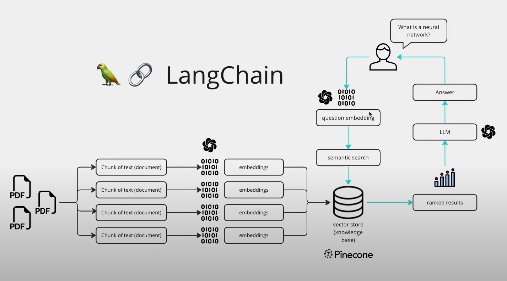

# Research Assiatant

### Architecture of Research Assistant 📚


> To run this project locally, follow the instructions:
1. Open a terminal, Clone this repo in your local system
```
git clone https://github.com/NandanHemanth/Research-Chatbot.git
```
2. Change to current working directory
```
cd Research-Chatbot
```
3. Open the link in a browser and download the Mistral-7B-large model and save it in the models folder
```
https://huggingface.co/TheBloke/CapybaraHermes-2.5-Mistral-7B-GGUF 
```
4. Install all the necessary dependencies
```
pip install -r requirements.txt
```
5. Run this command to launch localhost webapp
```
streamlit run app.py
```